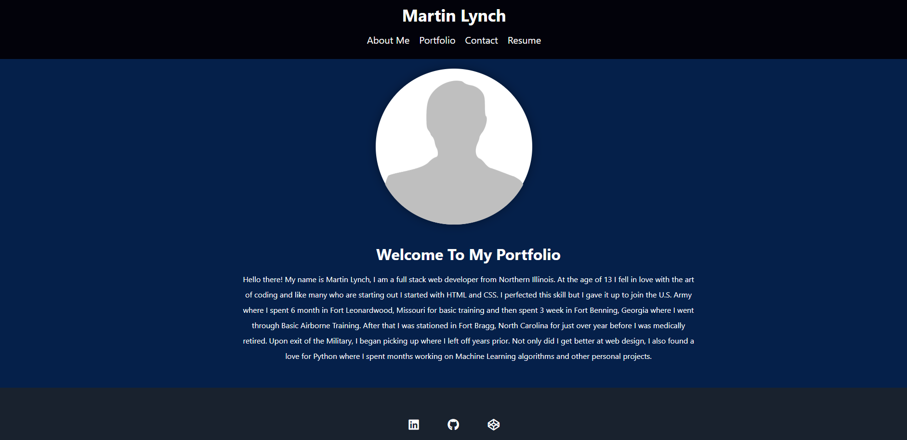

# React_Portfolio

## Description

This is a personal portfolio website built using React. It showcases my projects, skills, and experiences to provide an overview of my work and abilities. The portfolio is designed to be responsive, interactive, and easy to navigate.

## Installation

1. Clone the repository: git clone https://github.com/mjlynch123/React_Portfolio.git
2. Navigate to the project directory: cd React_Portfolio
3. Install the dependencies: npm install

## Usage

After completing the installation, you can run the portfolio locally by executing the following command:

    npm start

This command will start the development server, and you can access the portfolio in your web browser at http://localhost:3000.

Feel free to customize the content of the portfolio by modifying the relevant files in the project. You can update the project details, add or remove sections, and modify the styling to match your preferences. Make sure to review the documentation of the libraries and components used to understand their usage and customization options.

## [Deployed Site](https://martinlynchport.herokuapp.com/)
